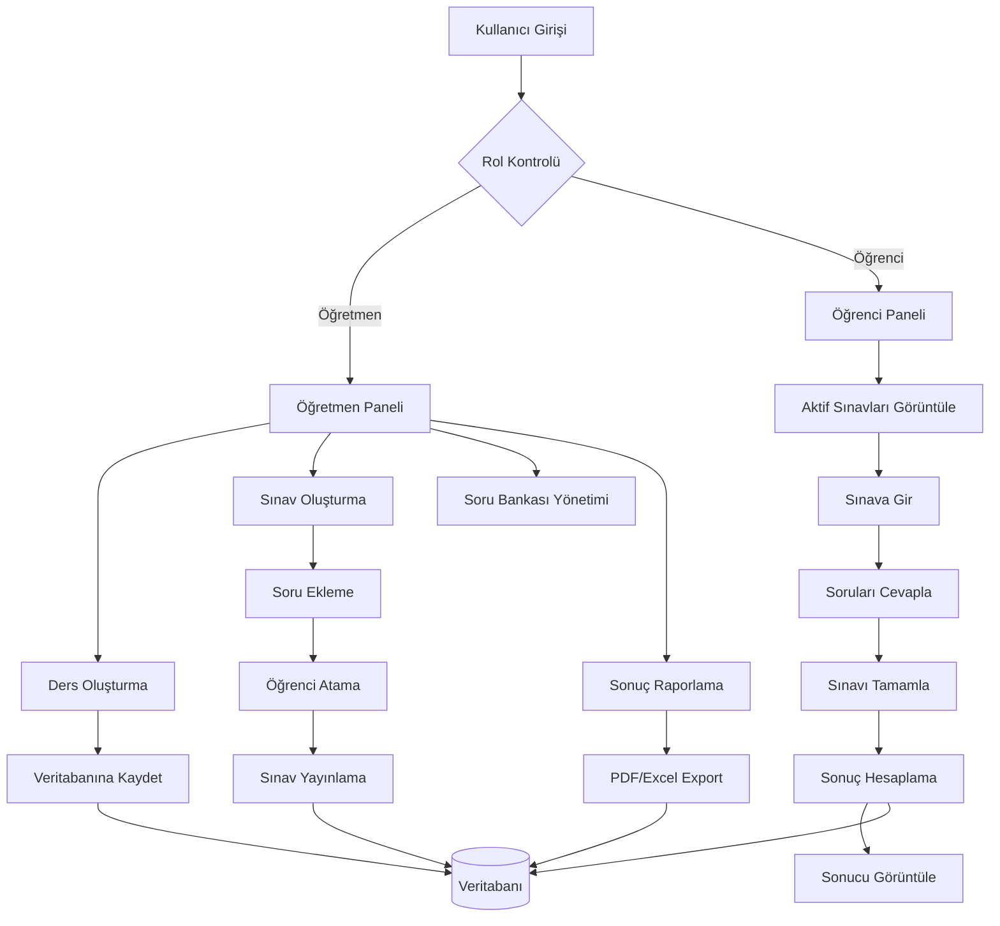

# Online Sınav Sistemi Proje Raporu

## Giriş

Bu proje, eğitim kurumlarında kullanılmak üzere geliştirilmiş kapsamlı bir online sınav sistemidir. Sistem, öğretmenlerin sınav oluşturmasına, öğrencilerin bu sınavlara katılmasına ve sonuçların otomatik olarak değerlendirilmesine olanak sağlamaktadır. 

Proje, modern web teknolojileri kullanılarak geliştirilmiş olup, katmanlı mimari prensiplerine uygun olarak tasarlanmıştır. Sistem, kullanıcı kimlik doğrulama, rol tabanlı yetkilendirme, sınav yönetimi, soru bankası, sonuç raporlama ve veri export özelliklerini içermektedir.

## Katkılar

| Öğrenci No | Ad Soyad | Katkı Alanı |
|------------|----------|-------------|
| 213311115 | Tolga Aygün | Rapor Yazımı |
| 213311119 | Burak Akkoç | Backend & Veritabanı Tasarımı |
| 223311032 | Ayça Demir | Frontend Proje Planı |
| 223311069 | Mustafa Çelik | Frontend |
| 223311081 | Rukiye Buse Işılak | Rapor Yazımı Proje Planı |

## Kullanılan/Kullanılacak Teknolojiler

### Programlama Dili: C#

**Tanım ve Özellikler:**
C#, Microsoft tarafından geliştirilen, nesne yönelimli, güçlü tiplemeli ve modern bir programlama dilidir. .NET Framework ve .NET Core/.NET 5+ platformları üzerinde çalışır. C#, Java ve C++ dillerinden etkilenerek geliştirilmiştir ve özellikle enterprise uygulamalar için tercih edilir.

**Neden Tercih Edildi:**
- Güçlü tip sistemi sayesinde derleme zamanında hata yakalama
- Microsoft ekosistemi ile mükemmel entegrasyon
- ASP.NET Core ile web uygulamaları geliştirme kolaylığı
- Entity Framework ile veritabanı işlemlerinde avantaj
- Geniş kütüphane desteği ve topluluk desteği
- Performans ve güvenlik açısından üstün özellikler

### Framework: ASP.NET Core 7.0

**Tanım ve Özellikler:**
ASP.NET Core, Microsoft'un açık kaynaklı, platformlar arası web uygulama geliştirme framework'üdür. Modern web API'leri, mikroservisler ve bulut uygulamaları geliştirmek için tasarlanmıştır. Dependency Injection, Middleware pipeline, Configuration management gibi modern yazılım geliştirme prensiplerini destekler.

**Neden Tercih Edildi:**
- Cross-platform desteği (Windows, Linux, macOS)
- Yüksek performans ve düşük bellek kullanımı
- Built-in Dependency Injection container
- Middleware pipeline ile esnek request/response işleme
- Razor Pages ile MVC pattern desteği
- Built-in authentication ve authorization
- Hot reload özelliği ile geliştirme kolaylığı

### Veritabanı: Microsoft SQL Server

**Tanım ve Özellikler:**
Microsoft SQL Server, Microsoft'un enterprise-grade ilişkisel veritabanı yönetim sistemidir. ACID özelliklerini destekler, yüksek performans ve güvenilirlik sunar. T-SQL dilini kullanır ve Windows Server ile mükemmel entegrasyon sağlar.

**Neden Tercih Edildi:**
- Entity Framework ile mükemmel entegrasyon
- Güçlü veri bütünlüğü ve güvenlik özellikleri
- Yüksek performans ve ölçeklenebilirlik
- Microsoft ekosistemi ile uyumluluk
- Zengin veri tipleri ve fonksiyonlar
- Backup ve recovery özellikleri

### ORM: Entity Framework Core 7.0

**Tanım ve Özellikler:**
Entity Framework Core, Microsoft'un açık kaynaklı Object-Relational Mapping (ORM) framework'üdür. Veritabanı işlemlerini nesne yönelimli yaklaşımla gerçekleştirmeyi sağlar. Code First, Database First ve Model First yaklaşımlarını destekler.

**Neden Tercih Edildi:**
- LINQ desteği ile güçlü sorgu yazma
- Code First yaklaşımı ile veritabanı migration'ları
- Lazy Loading ve Eager Loading desteği
- Change Tracking ve Unit of Work pattern
- Fluent API ile gelişmiş konfigürasyon
- Performance optimization araçları

### Authentication: ASP.NET Core Ientityd

**Tanım ve Özellikler:**
ASP.NET Core Identity, kullanıcı kimlik doğrulama ve yetkilendirme için Microsoft'un sağladığı framework'tür. Kullanıcı kaydı, giriş, şifre yönetimi, rol tabanlı yetkilendirme gibi özellikleri içerir.

**Neden Tercih Edildi:**
- Built-in kullanıcı yönetimi
- Güvenli şifre hash'leme
- Role-based authorization
- Cookie authentication desteği
- Two-factor authentication desteği
- Custom user store implementasyonu

### Frontend: Razor Pages & Bootstrap 5

**Tanım ve Özellikler:**
Razor Pages, ASP.NET Core'un server-side rendering yaklaşımıdır. HTML, CSS ve JavaScript ile birlikte C# kodunu tek dosyada birleştirir. Bootstrap ise responsive web tasarım için kullanılan CSS framework'üdür.

**Neden Tercih Edildi:**
- Server-side rendering ile SEO dostu
- Razor syntax ile kolay template yazma
- Bootstrap ile responsive tasarım
- jQuery entegrasyonu
- Component-based yaklaşım
- Minimal JavaScript gereksinimi

## Uygulama Çalışma Prensibi

### Sistem Mimarisi

Online Sınav Sistemi, katmanlı mimari (Layered Architecture) prensiplerine uygun olarak tasarlanmıştır:

```
┌─────────────────────────────────────┐
│           Presentation Layer        │
│     (Controllers, Views, Razor)     │
├─────────────────────────────────────┤
│           Business Layer            │
│        (Services, Interfaces)       │
├─────────────────────────────────────┤
│           Data Access Layer         │
│      (Repositories, DbContext)      │
├─────────────────────────────────────┤
│           Database Layer            │
│        (SQL Server Database)        │
└─────────────────────────────────────┘
```

### İş Akışı Diyagramı



### Detaylı İş Akışı Açıklaması

#### 1. Kullanıcı Kimlik Doğrulama Süreci
- Kullanıcı sisteme giriş yapar (Login)
- ASP.NET Core Identity sistemi kimlik doğrulama yapar
- Rol tabanlı yetkilendirme ile kullanıcı tipi belirlenir
- Session yönetimi ile kullanıcı oturumu başlatılır

#### 2. Öğretmen İş Akışı
**Ders Yönetimi:**
- Öğretmen yeni ders oluşturur
- Ders bilgileri Course modeli ile veritabanına kaydedilir
- CourseRepository üzerinden CRUD işlemleri gerçekleştirilir

**Sınav Oluşturma:**
- Öğretmen sınav bilgilerini girer (başlık, başlangıç/bitiş tarihi)
- Soru bankasından sorular seçilir veya yeni sorular eklenir
- Sınav için öğrenci ataması yapılır
- ExamStudent tablosu ile öğrenci-sınav ilişkisi kurulur

**Soru Bankası Yönetimi:**
- Sorular zorluk seviyesi, etiketler ve ders bilgileri ile kategorize edilir
- QuestionBank modeli ile sorular saklanır
- Sorular sınavlara eklenebilir

#### 3. Öğrenci İş Akışı
**Sınav Görüntüleme:**
- Öğrenci aktif sınavları görüntüler
- Sınav zamanı kontrolü yapılır
- Sadece atanmış sınavlar gösterilir

**Sınav Alma:**
- Öğrenci sınava başlar
- StudentExam kaydı oluşturulur
- Sorular sırayla gösterilir
- Cevaplar StudentAnswer tablosuna kaydedilir
- Geri dönme izni kontrolü yapılır

**Sonuç Hesaplama:**
- Sınav tamamlandığında otomatik puanlama yapılır
- Doğru cevaplar sayılır ve puan hesaplanır
- Sonuç StudentExam tablosuna kaydedilir

#### 4. Veri Akışı ve İlişkiler
**Temel İlişkiler:**
- User (1) → Course (N): Bir öğretmen birden fazla derse sahip olabilir
- Course (1) → Exam (N): Bir dersin birden fazla sınavı olabilir
- Exam (1) → Question (N): Bir sınavın birden fazla sorusu olabilir
- Exam (N) → Student (N): Çoktan çoğa ilişki (ExamStudent tablosu)
- StudentExam (1) → StudentAnswer (N): Bir öğrenci sınavının birden fazla cevabı

**Veri Bütünlüğü:**
- Foreign Key constraints ile referans bütünlüğü sağlanır
- Check constraints ile veri doğrulaması yapılır
- Unique constraints ile tekrar kayıtlar önlenir

#### 5. Güvenlik ve Yetkilendirme
- Role-based authorization ile sayfa erişimleri kontrol edilir
- Session timeout ile güvenlik sağlanır
- SQL Injection koruması Entity Framework ile sağlanır
- XSS koruması Razor Pages ile otomatik sağlanır

#### 6. Performans Optimizasyonları
- Repository pattern ile veri erişimi soyutlanır
- Dependency Injection ile loose coupling sağlanır
- Async/await pattern ile non-blocking işlemler
- Entity Framework lazy loading ile gereksiz veri çekme önlenir

Bu sistem, modern yazılım geliştirme prensiplerine uygun olarak tasarlanmış olup, ölçeklenebilir, bakımı kolay ve güvenli bir yapı sunmaktadır.
